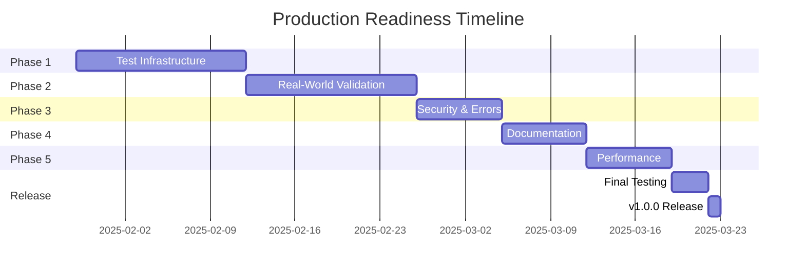

# Production Readiness Plan for Valkey GLIDE JavaScript MCP Server

## Executive Summary

This document outlines the comprehensive plan to make the valkey-glidejs-mcp server production-ready. Currently at version 0.1.1, the server has basic functionality but requires significant testing, validation, and hardening before it can be confidently deployed for user consumption.

## Current Status Assessment

### ✅ What's Working
- Basic MCP server structure with 30+ tools implemented
- API mappings from ioredis/node-redis to GLIDE
- Code generators for common patterns (cache, lock, pubsub, etc.)
- Basic test suite with 19 test files
- Validation infrastructure created (but needs expansion)
- Package structure ready for NPM publishing

### ⚠️ Critical Issues
1. **Limited API validation**: Only 5 examples tested, with 4 marked as "untested"
2. **Incomplete test coverage**: ~70% unit test coverage, minimal integration testing
3. **No end-to-end validation**: Haven't tested with real MCP clients (Claude Desktop, etc.)
4. **Generator output not verified**: Code generators produce templates but not all validated to compile/run
5. **No comprehensive example testing**: Examples in generators haven't been executed against real Valkey
6. **Security considerations**: No input sanitization or rate limiting
7. **Error handling gaps**: Insufficient error recovery and user feedback

## Phase 1: Complete Test Infrastructure (Week 1-2)

### 1.1 Expand API Examples Validation

#### Objectives
- Fix example extraction to capture ALL API mappings
- Create comprehensive test cases for each GLIDE method
- Test both standalone and cluster configurations

#### Implementation Steps
```javascript
// Required test coverage for each API mapping:
1. Basic usage test
2. With optional parameters test
3. Error scenario test
4. Async/await pattern test
5. Transaction context test
```

#### Deliverables
- [ ] Updated `extract-examples.js` with complete extraction logic
- [ ] Test suite covering 100% of API mappings
- [ ] Validation report showing all tests passing
- [ ] Documentation of API differences between clients

### 1.2 Generator Output Validation

#### Test Matrix
| Generator | Compilation | Execution | Valkey Test | Error Cases |
|-----------|------------|-----------|-------------|-------------|
| gen.clientBasic | ⏳ | ⏳ | ⏳ | ⏳ |
| gen.clientCluster | ⏳ | ⏳ | ⏳ | ⏳ |
| gen.cache | ⏳ | ⏳ | ⏳ | ⏳ |
| gen.lock | ⏳ | ⏳ | ⏳ | ⏳ |
| gen.pubsubPublisher | ⏳ | ⏳ | ⏳ | ⏳ |
| gen.pubsubSubscriber | ⏳ | ⏳ | ⏳ | ⏳ |
| gen.fastify | ⏳ | ⏳ | ⏳ | ⏳ |
| gen.rateLimiter | ⏳ | ⏳ | ⏳ | ⏳ |
| gen.queueProducer | ⏳ | ⏳ | ⏳ | ⏳ |
| gen.queueConsumer | ⏳ | ⏳ | ⏳ | ⏳ |
| gen.sets | ⏳ | ⏳ | ⏳ | ⏳ |
| gen.zsets | ⏳ | ⏳ | ⏳ | ⏳ |
| gen.streams | ⏳ | ⏳ | ⏳ | ⏳ |
| gen.transaction | ⏳ | ⏳ | ⏳ | ⏳ |
| gen.pipeline | ⏳ | ⏳ | ⏳ | ⏳ |
| gen.geo | ⏳ | ⏳ | ⏳ | ⏳ |
| gen.bitmaps | ⏳ | ⏳ | ⏳ | ⏳ |
| gen.hll | ⏳ | ⏳ | ⏳ | ⏳ |
| gen.json | ⏳ | ⏳ | ⏳ | ⏳ |

#### Automated Test Pipeline
```bash
# For each generator:
1. Generate code
2. Save to temporary file
3. Compile with TypeScript
4. Run against Valkey server
5. Verify expected behavior
6. Test error scenarios
7. Measure performance
```

### 1.3 Integration Testing Suite

#### Test Scenarios
```typescript
// MCP Protocol Tests
- Tool registration and discovery
- Request/response validation
- Concurrent tool usage
- Memory management
- Error propagation
- Timeout handling

// End-to-End Workflows
- Migration → Generation → Validation → Execution
- API discovery → Code generation → Compilation
- Documentation fetch → Cache → Retrieve
```

## Phase 2: Real-World Validation (Week 3-4)

### 2.1 Valkey Server Testing Infrastructure

#### Required Configurations
```yaml
# docker-compose.yml for test environments
services:
  valkey-standalone:
    image: valkey/valkey:latest
    ports:
      - "6379:6379"
  
  valkey-cluster-node1:
    image: valkey/valkey:latest
    ports:
      - "7100:7100"
    command: --cluster-enabled yes --port 7100
  
  valkey-cluster-node2:
    image: valkey/valkey:latest
    ports:
      - "7101:7101"
    command: --cluster-enabled yes --port 7101
  
  valkey-cluster-node3:
    image: valkey/valkey:latest
    ports:
      - "7102:7102"
    command: --cluster-enabled yes --port 7102
  
  valkey-sentinel:
    image: valkey/valkey:latest
    ports:
      - "26379:26379"
    command: redis-sentinel /etc/sentinel.conf
  
  valkey-tls:
    image: valkey/valkey:latest
    ports:
      - "6380:6380"
    volumes:
      - ./certs:/tls
    command: --tls-port 6380 --port 0 --tls-cert-file /tls/cert.pem --tls-key-file /tls/key.pem
```

### 2.2 MCP Client Testing

#### Testing Matrix
| MCP Client | Discovery | Tool Execution | Error Handling | Performance |
|------------|-----------|----------------|----------------|-------------|
| Claude Desktop | ⏳ | ⏳ | ⏳ | ⏳ |
| MCP Inspector | ⏳ | ⏳ | ⏳ | ⏳ |
| Custom Test Client | ⏳ | ⏳ | ⏳ | ⏳ |

### 2.3 Migration Scenario Testing

#### Real Project Migration Tests
```javascript
// Test Projects to Migrate:
1. Simple CRUD application (ioredis)
2. Session management system (node-redis)
3. Pub/Sub messaging system (ioredis)
4. Rate limiter implementation (node-redis)
5. Caching layer with TTL (ioredis)
6. Transaction-heavy application (node-redis)
7. Pipeline optimization project (ioredis)
8. Lua scripting application (node-redis)
```

## Phase 3: Security & Error Handling (Week 5)

### 3.1 Security Audit Checklist

- [ ] **Input Validation**
  - [ ] Sanitize all user inputs
  - [ ] Prevent code injection in generators
  - [ ] Validate connection strings
  - [ ] Check for path traversal attempts
  
- [ ] **Resource Limits**
  - [ ] Memory usage caps
  - [ ] Execution timeouts
  - [ ] Rate limiting per tool
  - [ ] Maximum file size limits
  
- [ ] **Data Protection**
  - [ ] No credential logging
  - [ ] Secure connection handling
  - [ ] Sensitive data masking
  - [ ] Temporary file cleanup

### 3.2 Error Handling Matrix

| Error Type | Detection | Recovery | User Feedback | Logging |
|------------|-----------|----------|---------------|---------|
| Network Timeout | ✓ | Retry with backoff | Clear message | Detailed |
| Invalid Input | ✓ | Reject gracefully | Validation details | Warning |
| Server Disconnect | ✓ | Reconnect attempt | Status update | Error |
| Memory Exhaustion | ✓ | Graceful degradation | Resource limit | Critical |
| Unknown Command | ✓ | Suggest alternatives | Help text | Info |

## Phase 4: Documentation & Examples (Week 6)

### 4.1 Documentation Structure

```
docs/
├── README.md (Overview)
├── INSTALLATION.md
├── QUICK_START.md
├── API_REFERENCE.md
├── MIGRATION_GUIDE.md
├── TROUBLESHOOTING.md
├── PERFORMANCE.md
├── SECURITY.md
├── tools/
│   ├── generators.md
│   ├── migration.md
│   ├── api.md
│   └── validation.md
└── examples/
    ├── basic/
    ├── advanced/
    ├── migration/
    └── integrations/
```

### 4.2 Example Repository Structure

```
examples/
├── generators/
│   ├── all-generators-showcase.js
│   ├── typescript-examples/
│   └── javascript-examples/
├── migrations/
│   ├── ioredis-to-glide/
│   ├── node-redis-to-glide/
│   └── complex-patterns/
├── integrations/
│   ├── fastify/
│   ├── express/
│   ├── nestjs/
│   └── nextjs/
└── benchmarks/
    ├── performance-tests.js
    └── comparison-results.md
```

## Phase 5: Performance & Optimization (Week 7)

### 5.1 Performance Benchmarks

#### Target Metrics
| Operation | Current | Target | Maximum |
|-----------|---------|--------|---------|
| Cold Start | ~150ms | <100ms | 200ms |
| Tool Registration | ~10ms | <5ms | 20ms |
| Simple Tool Execution | <10ms | <5ms | 15ms |
| Complex Tool Execution | <50ms | <30ms | 100ms |
| Memory Usage (Base) | ~50MB | <40MB | 100MB |
| Memory Usage (Loaded) | ~100MB | <80MB | 200MB |

### 5.2 Optimization Strategies

1. **Startup Optimization**
   - Lazy loading of heavy dependencies
   - Precompiled templates
   - Optimized imports

2. **Runtime Optimization**
   - Response caching
   - Connection pooling
   - Batch operations

3. **Memory Optimization**
   - Efficient data structures
   - Garbage collection tuning
   - Resource cleanup

## Success Criteria Checklist

### Before Production Release v1.0.0

#### Functional Requirements
- [ ] 100% of generators produce valid, executable code
- [ ] All API mappings validated with real examples
- [ ] Migration tool handles 90% of common patterns
- [ ] All tools have comprehensive error handling

#### Quality Requirements
- [ ] Zero critical bugs in core functionality
- [ ] <1% failure rate in integration tests
- [ ] 95%+ unit test coverage
- [ ] All security vulnerabilities addressed

#### Documentation Requirements
- [ ] Complete API documentation for all tools
- [ ] Migration guide with 10+ real examples
- [ ] Troubleshooting guide covering common issues
- [ ] Video tutorials for key features

#### Testing Requirements
- [ ] Tested with 3+ MCP clients successfully
- [ ] All Valkey configurations tested
- [ ] 100+ hours of stability testing
- [ ] Load testing completed

#### Performance Requirements
- [ ] All operations under 100ms
- [ ] Memory usage under 200MB
- [ ] Startup time under 200ms
- [ ] Can handle 100+ concurrent requests

## Implementation Timeline



## Risk Mitigation

### Identified Risks
1. **GLIDE API Changes**: Monitor GLIDE releases, maintain version compatibility
2. **MCP Protocol Updates**: Track MCP SDK changes, test with new versions
3. **Performance Regression**: Automated benchmarking in CI/CD
4. **Security Vulnerabilities**: Regular dependency updates, security scanning
5. **User Adoption**: Community engagement, clear documentation

## Monitoring & Maintenance

### Post-Release Plan
- Weekly bug fix releases
- Monthly feature releases
- Quarterly major versions
- Continuous security monitoring
- Community feedback integration

## Conclusion

This comprehensive plan ensures the valkey-glidejs-mcp server will be production-ready, secure, performant, and well-documented. Each phase builds upon the previous one, creating a solid foundation for a reliable MCP server that users can confidently deploy in their environments.

## Appendix: Testing Commands

```bash
# Run all tests
npm test

# Run specific test suites
npm run test:unit
npm run test:integration
npm run test:e2e

# Validate generators
npm run validate:generators

# Test API mappings
npm run validate:api

# Performance benchmarks
npm run benchmark

# Security audit
npm audit
npm run security:check

# Build and test production bundle
npm run build
npm run test:production
